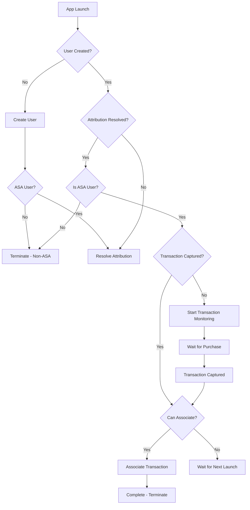

# ASA Attribution SDK

A lightweight Apple Search Ads attribution SDK that efficiently tracks user attribution and associates purchase transactions with minimal performance impact.

## Features

- ✅ **Automatic ASA Attribution**: Detects if users originated from Apple Search Ads campaigns
- ✅ **Transaction Tracking**: Captures StoreKit purchase transactions for ASA users
- ✅ **Backend Integration**: Seamlessly connects with Supabase edge functions
- ✅ **State Management**: Persistent tracking of user flow progress
- ✅ **Error Handling**: Robust retry logic with exponential backoff
- ✅ **Performance Optimized**: Minimal battery and network impact
- ✅ **Self-Terminating**: Stops operations when flow is complete or user is non-ASA

## Architecture

The SDK follows a modular architecture with clear separation of concerns:

### Core Components

1. **ASAAttributionSDK** - Main SDK class orchestrating the flow
2. **APIClient** - Handles backend communication with authentication
3. **StateManager** - Manages persistent state tracking
4. **ASAAttributionManager** - Fetches Apple Search Ads attribution tokens
5. **TransactionMonitor** - Monitors StoreKit transactions (both v1 and v2)

### State Machine Flow



## Installation

### Swift Package Manager

Add the package to your project:

```swift
dependencies: [
    .package(url: "https://github.com/your-org/ASAAttributionSDK.git", from: "1.0.0")
]
```

### Manual Installation

1. Clone the repository
2. Add the `ASAAttributionSDK` folder to your Xcode project
3. Ensure AdServices framework is linked

## Usage

### Basic Integration

#### SwiftUI Apps

```swift
import SwiftUI
import ASAAttributionSDK

@main
struct MyApp: App {
    init() {
        // Configure the SDK on app launch - returns immediately, runs in background
        ASAAttributionSDK.shared.configure(apiKey: "your-api-key")
    }
    
    var body: some Scene {
        WindowGroup {
            ContentView()
        }
    }
}
```

#### UIKit Apps

```swift
import UIKit
import ASAAttributionSDK

@main
class AppDelegate: UIResponder, UIApplicationDelegate {
    func application(_ application: UIApplication, didFinishLaunchingWithOptions launchOptions: [UIApplication.LaunchOptionsKey: Any]?) -> Bool {
        
        // Configure the SDK - returns immediately, runs in background
        ASAAttributionSDK.shared.configure(apiKey: "your-api-key")
        
        return true
    }
}
```

### Configuration Parameters

- **apiKey**: Your backend API key for authentication (the base URL is hardcoded in the SDK)

## SDK Flow Logic

The SDK executes the following flow on every app launch:

### 1. Check User Status
- Determines if user exists in local storage
- If no user: proceeds to create new user
- If user exists: checks attribution status

### 2. Create New User
- Fetches ASA attribution token (if available)
- Calls `create-user` backend function
- Stores returned user ID locally
- May resolve attribution immediately if token was provided

### 3. Resolve ASA Attribution
- Calls `resolve-asa-attribution` with attribution token
- Handles three outcomes:
  - **ASA user**: Stores attribution data, continues flow
  - **Non-ASA user**: Terminates SDK operations
  - **Resolution pending**: Retries on next launch

### 4. Transaction Monitoring
- Starts StoreKit transaction listener (ASA users only)
- Captures original transaction ID from purchases
- Supports both StoreKit 1 and StoreKit 2

### 5. Associate Transaction
- Calls `associate-user` with user ID and transaction ID
- Marks association as complete
- Terminates SDK operations

## State Management

The SDK tracks these persistent states:

| State | Description |
|-------|-------------|
| `userCreated` | User record exists in backend |
| `attributionResolved` | ASA attribution has been determined |
| `isASAUser` | User originated from Apple Search Ads |
| `transactionCaptured` | Purchase transaction ID captured |
| `associationComplete` | Transaction linked to user record |
| `userId` | Backend user ID |
| `originalTransactionID` | StoreKit transaction ID |

## Backend Integration

The SDK connects to three Supabase edge functions:

### create-user
Creates new user records with optional ASA attribution token.

**Request:**
```json
{
  "asa_attribution_token": "optional-token-string"
}
```

**Response:**
```json
{
  "userId": 123,
  "didUserComeFromAsa": true,
  "asaAttributionResolved": true
}
```

### resolve-asa-attribution
Resolves ASA attribution for existing users.

**Request:**
```json
{
  "user_id": 123,
  "asa_attribution_token": "token-string"
}
```

**Response:**
```json
{
  "didUserComeFromAsa": true,
  "asaAttributionResolved": true
}
```

### associate-user
Links transaction IDs to user records.

**Request:**
```json
{
  "user_id": 123,
  "transaction_id": "transaction-id-string"
}
```

**Response:**
```json
{
  "success": true,
  "user": {
    "id": 123,
    "transaction_id": "transaction-id-string"
  }
}
```

## Error Handling

The SDK implements robust error handling:

- **Network failures**: Automatic retry with exponential backoff
- **API errors**: Detailed logging with error messages
- **Invalid states**: Graceful handling with retry on next launch
- **Token resolution failures**: Continues flow on subsequent launches

## Performance Optimizations

- **Non-blocking configuration**: Returns immediately, all operations run in background threads
- **Thread-safe state management**: Concurrent reads with barrier writes for optimal performance
- **Parallel execution**: Attribution resolution and transaction monitoring run concurrently
- **Background queues**: Dedicated background queue prevents main thread blocking
- **Smart termination**: Stops monitoring when flow is complete
- **Efficient caching**: Avoids redundant API calls

## Debugging

### Check Current State
```swift
let state = ASAAttributionSDK.shared.getDebugState()
print(state)
```

### Reset State (Testing)
```swift
ASAAttributionSDK.shared.resetState()
```

### Console Logging
Filter Console.app by subsystem: `com.asaattribution.sdk`

## Logging

The SDK includes comprehensive logging for debugging and development:

### Development Environment
- **Full logging enabled** in DEBUG builds
- **Detailed transaction monitoring** logs
- **API request/response logging**
- **State machine flow logging**
- **Error and retry logging**

### Production Environment
- **Logging disabled** in RELEASE builds for performance and privacy
- **No debug information** logged to console
- **Minimal performance impact**

### Check Environment
```swift
// Check if running in production
if ASAAttributionSDK.isProduction {
    print("Running in production - logging disabled")
} else {
    print("Running in development - logging enabled")
}
```

## Testing

### Unit Tests
The modular architecture enables comprehensive testing:

```swift
// Test state management
let stateManager = StateManager()
stateManager.setUserCreated(userId: "123")
XCTAssertTrue(stateManager.userCreated)

// Test API client
let apiClient = APIClient(apiKey: "test-key")
// Mock network responses for testing
```

### Integration Tests
```swift
// Reset state for clean testing
ASAAttributionSDK.shared.resetState()

// Configure with test credentials
ASAAttributionSDK.shared.configure(apiKey: "test-key")

// Verify state transitions
let state = ASAAttributionSDK.shared.getDebugState()
```

## Requirements

- **iOS**: 13.0+ (ASA attribution requires iOS 14.3+)
- **Swift**: 5.9+
- **Frameworks**: StoreKit, AdServices
- **Backend**: Supabase edge functions

## API Key Security

- Store API keys securely using Keychain Services
- Use different keys for development/production
- Implement key rotation for enhanced security
- Never commit keys to version control

## Contributing

1. Fork the repository
2. Create a feature branch
3. Implement changes with tests
4. Submit a pull request

## License

This project is licensed under the MIT License - see the LICENSE file for details.

## Support

For issues and questions:
- Check the documentation
- Review console logs
- File an issue on GitHub
- Contact support team 